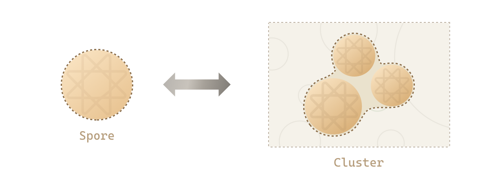
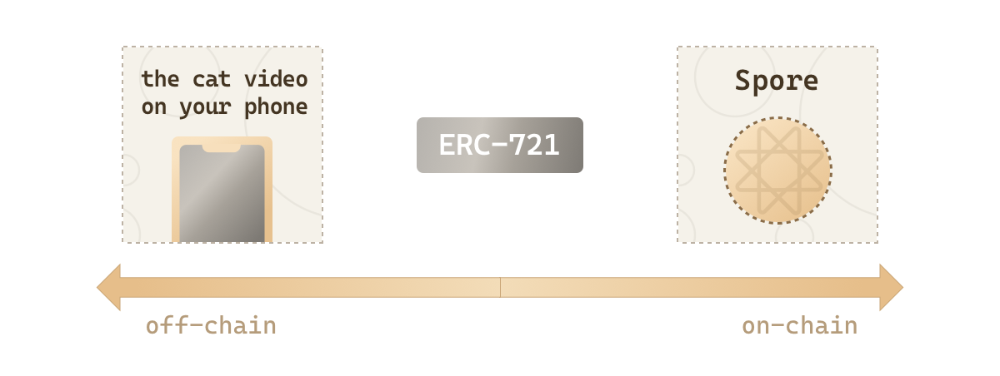
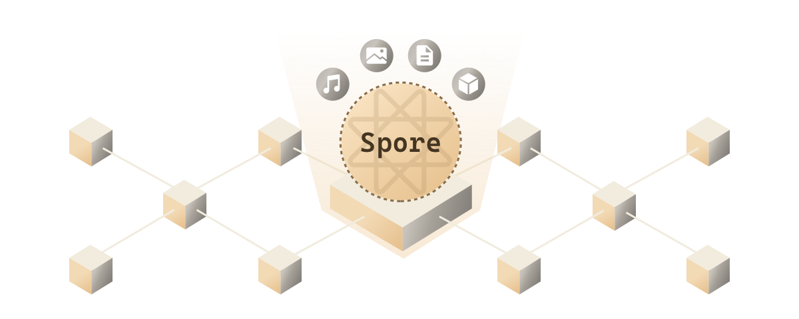

# Spore Protocol 101

### What is Spore and Cluster?

A **Spore** can be thought of a valuable digital artifact. When you have multiple artifacts you want to organize together, you create a **Cluster**. However, these artifacts aren't stored in a single location; instead, they are stored on a decentralized network that thousands of people all over the world help operate.

### What is an On-Chain Asset?

An "on-chain" asset refers to a digital asset with a significant portion of its data directly encoded onto the blockchain. There's a spectrum of "on-chain" attributes, with on-chain NFTs generally being seen as more censorship-resistant, permanent, and secure compared to "off-chain" alternatives. However, the majority of NFTs are more "off-chain" than "on-chain."

### What does it mean to be Fully On-Chain?

The Spore Protocol takes your asset fully on-chain, meaning all of its data is encoded and stored directly on the blockchain. This makes your asset more secure and resilient, and it cannot be taken away or destroyed by anyone else when it's in your hands.

### What is Minting?

Minting transforms your creation or any item into a unique digital asset on the blockchain. When minting with the Spore Protocol, your asset is not only created but also securely stored, establishing its immutable record of ownership. In contrast, minting on other platforms or protocols may only involve publishing NFTs on the blockchain without the same level of storing of data and security.

### Is there a cost to mint a Spore?

Minting NFTs often involves unpredictable gas fee expenses and the NFTs are not even fully on-chain. 

With Spore Protocol, you are not spending on fees - you acquire ✨ capital ✨. This capital, in CKBytes, secure ownership and reserve a portion of the network's resources to safeguard your creation. 

With your creation fully on-chain, larger creations need more reserved capital. Don’t worry - the CKBytes used for reservation is not spent; instead, it is locked in your creation itself. Think of it like forging gold into an exquisite artifact - the value is preserved within the work itself. If you ever want to melt down the artifact back into its original form or redeem the CKBytes, you have that flexibility. Your creation, your rules.

### Intrigued？Explore Spores and Clusters on the testnet using this demo!

[Spore Demo](https://a-simple-demo.spore.pro/)

