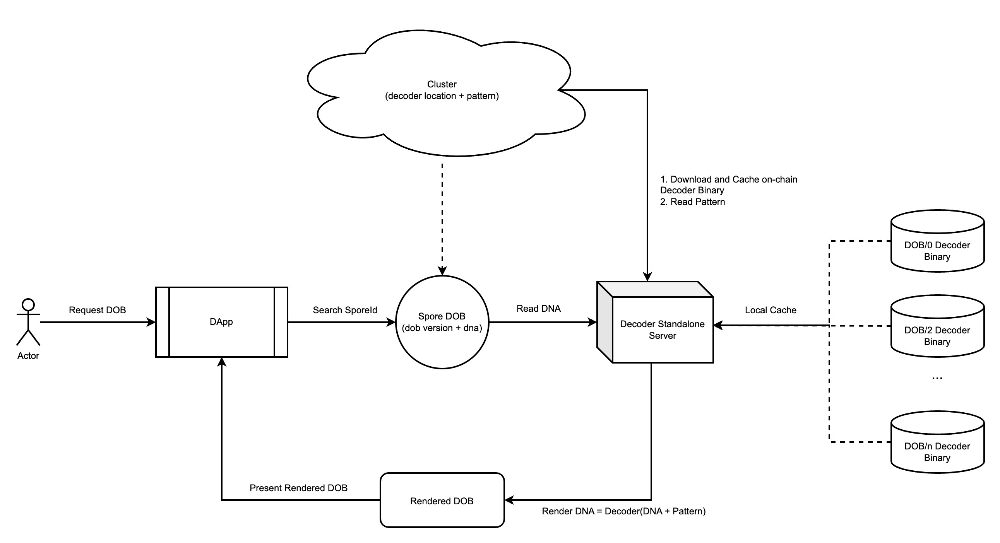

# DOB Protocol Family

## Introduction

If the Spore protocol stores value in Cells, then the DOB (Digital Object) protocol family built on top of it lays the foundation for Cells to be interpreted and combined.

The DOB protocol family contains multiple protocols, such as DOB/0, DOB/1 or DOB/2. They are all based on the abstract combination of `DNA + Pattern + Decoder`:

- `DNA`: Unique data owned by each DOB, specified when the DOB is minted.
- `Pattern` : Common data for a set of DOBs specified when creating the DOB Cluster.
- `Decoder` : Interpreter for `DNA` and `Pattern`, specified when DOB Cluster is released. Creators give simple bytes the ability to describe themselves through unrestricted decoders.

The figure below shows the relationship between DOB’s parties:



## Links

Common decoding server for DOB protocol family https://github.com/sporeprotocol/dob-decoder-standalone-server

## Protocols

[DOB/0 Protocol](https://www.notion.so/DOB-0-Protocol-52a5bc6a381e4e0682e2e8801ba25b93?pvs=21): The first step in the DOB protocol family. The DOB/0 protocol specifies the configuration method and interface format of the decoder on DOB and provides a universal decoder to reduce the development workload of most applications.

## Create DOB using DOB/0 protocol

Create a Cluster with DOB/0 protocol

```jsx
import { createCluster } from '@spore-sdk/api';
import { bytifyRawString } from '@spore-sdk/helpers/buffer';

const account = ...;
const dob_metadata = {
	description: 'this is the description for cluster',
	dobs: {
		ver: 0,
		decoder: {
			type: 'code_hash',
			hash: '...',
		},
		pattern: [["Age", "number", 1, 1, "range", [0, 100]]],
	}
};

const { txSkeleton, outputIndex } = await createCluster({
  data: {
    name: 'My First DOB Cluster',
    description: bytifyRawString(JSON.strinify(dob_metadata)),
  },
  fromInfos: [account.address],
  toLock: account.lock
});

// sign for txSkeleton
```

Create a DOB with `content_type` as `dob/0`

```tsx
import { createSpore } from '@spore-sdk/api';
import { bytifyRawString } from '@spore-sdk/helpers/buffer';

const account = ...;
const dob_cluster_id = ...;
const dob_content = {
	dna: 'df4ffcb5e7a283ea7e6f09a504d0e256'
};

const { txSkeleton, outputIndex } = await createSpore({
  data: {
    content_type: 'dob/0',
    content: bytifyRawString(JSON.strinify(dob_content)),
    cluster_id: dob_cluster_id
  },
  fromInfos: [account.address],
  toLock: account.lock
});

// sign for txSkeleton
```

## DOB decoding interface

After creating the Spore DOB, you can view its `spore_id` data and decode its DNA through the `spore_id` and the decoding server. Before that, you need to install the decoding server locally:

```bash
$ git clone https://github.com/sporeprotocol/dob-decoder-standalone-server
$ RUST_LOG=dob_decoder_server=debug cargo run
```

The decoding server runs on CKB Testnet by default. To run it on CKB Mainnet, exchange the `setting.mainnet.toml` configuration in the root directory with the `setting.toml` configuration.

After starting the server, decode a specified Spore DOB by the following request:

```bash
$ echo '{
    "id": 2,
    "jsonrpc": "2.0",
    "method": "dob_decode",
    "params": [
        "<spore_id in hex format without 0x prefix>"
    ]
}' \
| curl -H 'content-type: application/json' -d @- \
http://localhost:8090
```